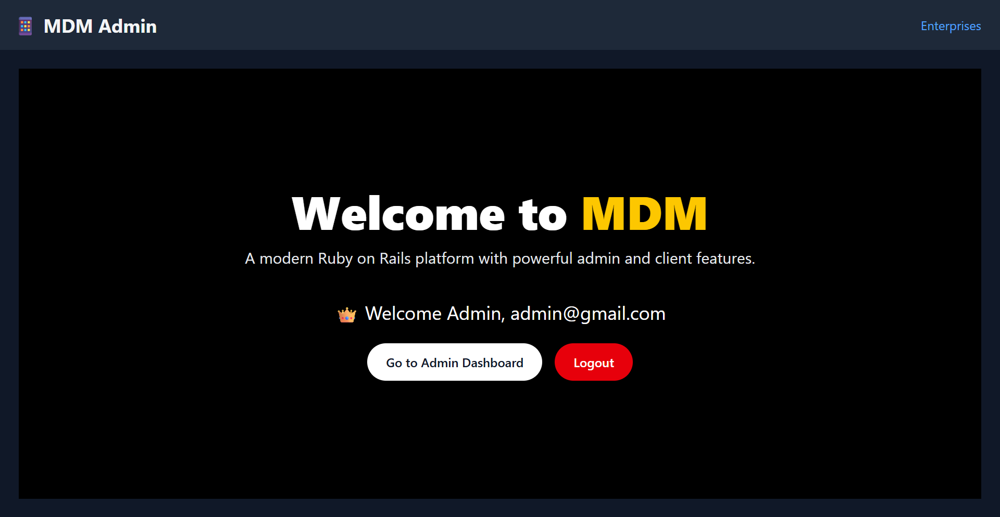
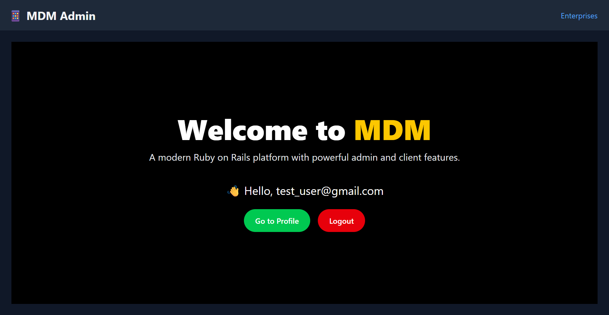

# 📱 Mobile Device Management (MDM) Platform  
*A real-world Ruby on Rails 7 system for remotely managing, installing, and uninstalling apps on Android & Apple devices.*

---

## 🚀 Overview

This platform enables organizations to securely **manage client devices** through a centralized web interface.  
Admins can **enroll devices**, **send commands**, and **monitor installation/uninstallation** actions using integrated Apple App Store / Google Play APIs.  

It features two dashboards:
- **Admin Dashboard** — for super-admins to manage enterprises & devices.
- **Client Dashboard** — for enterprise admins to monitor and control their own devices.

---

## 🧩 Features

- 🔐 **Authentication** via Devise  
- 🏢 **Enterprise Management** (CRUD)  
- 📱 **Device Enrollment** & Status Tracking  
- ☁️ **Remote Install / Uninstall Apps** via API  
- 🧭 **Dual Dashboard:** Admin & Client  
- 🎨 **Tailwind CSS** responsive UI  
- ⚙️ **Background Command Queue (Sidekiq)**  
- 🧾 **Real-Time Command Status**  
- 🛡️ **Role-based Access Control**

---

## 🏗️ Tech Stack

| Layer | Technology |
|-------|-------------|
| Backend | Ruby on Rails 7 |
| Database | PostgreSQL |
| Authentication | Devise |
| Background Jobs | Sidekiq + Redis |
| Frontend | Tailwind CSS |
| Deployment | Docker / Render / Heroku |
| APIs | Apple Store & Play Store integration |

---

## ⚙️ Installation & Setup

### 1️⃣ Clone Repository
```bash
git clone https://github.com/ShiboshreeRoy/mdm_server.git
cd mdm_server
````

### 2️⃣ Install Dependencies

```bash
bundle install
yarn install
```

### 3️⃣ Setup Database

```bash
rails db:create db:migrate db:seed
```

### 4️⃣ Start Sidekiq (Background Jobs)

```bash
bundle exec sidekiq
```

### 5️⃣ Run Server

```bash
bin/dev
```

Access the app at **[http://localhost:3000](http://localhost:3000)**

---

## 🔐 Admin Roles

| Role             | Description                                     |
| ---------------- | ----------------------------------------------- |
| **super_admin**  | Full access to all enterprises & devices        |
| **client_admin** | Limited access to their enterprise devices only |

---

## 🧭 Dashboards

### 🛠️ Admin Dashboard

* Manage all enterprises & devices
* Trigger remote app install/uninstall
* Monitor device connectivity

### 👤 Client Dashboard

* View and manage their own devices
* Execute limited commands

---

## 🖼️ UI Preview

| Admin Dashboard                                              | Client Dashboard                                               |
| ------------------------------------------------------------ | -------------------------------------------------------------- |
|  |  |

---

## 🔄 Command Flow

1. **Admin** sends an install/uninstall request
2. **Command** is queued via **Sidekiq**
3. **Device Agent** polls command API
4. **Result** is pushed back and logged

---

## 🧱 Directory Structure

```
app/
 ├─ controllers/
 │   ├─ admin/
 │   └─ client/
 ├─ models/
 │   ├─ enterprise.rb
 │   ├─ device.rb
 │   └─ command.rb
 ├─ views/
 │   ├─ admin/
 │   └─ client/
 ├─ jobs/
 ├─ services/        # API logic (Apple/Google)
 ├─ workers/         # Background Sidekiq tasks
config/
db/
```

---

## 🧰 Environment Variables

Create `.env` file (or use Rails credentials):

```
APPLE_API_KEY=your_apple_key
GOOGLE_API_KEY=your_playstore_key
REDIS_URL=redis://localhost:6379
```

---

## 🧾 API Endpoints

| Method | Endpoint                     | Description            |
| ------ | ---------------------------- | ---------------------- |
| `GET`  | `/api/devices`               | List all devices       |
| `POST` | `/api/devices/:id/install`   | Install app remotely   |
| `POST` | `/api/devices/:id/uninstall` | Uninstall app remotely |

---

## 🧑‍💻 Contributing

1. Fork this repo
2. Create a new branch `feature/your-feature`
3. Commit and push
4. Submit a pull request

---

## 🪪 License

This project is licensed under the **MIT License** — see [LICENSE](./LICENSE) for details.

---

## ✉️ Author

**👨‍💻 Shiboshree Roy**
Ruby on Rails 7 Developer & System Architect
💼 Building secure, scalable real-world platforms
📧 Contact: [[shiboshreeroycse@gmail.com](mailto:shiboshreeroycse@gmail.com)]

---

## 🌟 Acknowledgements

* [Ruby on Rails](https://rubyonrails.org)
* [Tailwind CSS](https://tailwindcss.com)
* [Sidekiq](https://sidekiq.org)
* [Devise](https://github.com/heartcombo/devise)

---

> “Empower organizations to control devices safely — one command at a time.”

